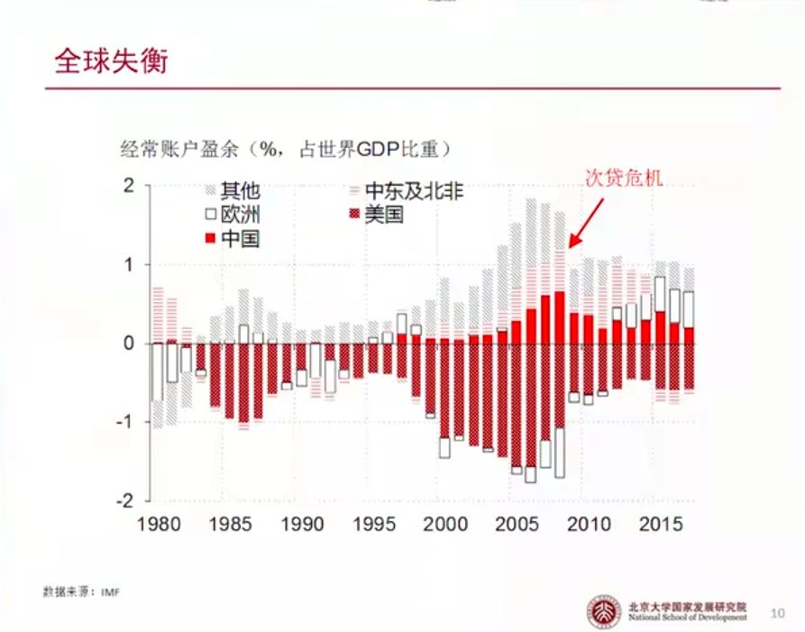

## 中国消费不足的班子不能只打在国企身上--国企占中国经济的比重已经下降了很多

国企改革必须要考虑的问题

- “内部人控制” （inside cotrol） 问题
- “政策性负担”、“缺乏自生能力”问题
- 国家诉求与民众诉求的兼顾
- 维护社会稳定，平稳过渡

## 传统的国资委直管国企模式下，国资委怎么知道国企应该投资和分红多少

## 建立三级管理国资体制，构造国企所有权竞争市场，让消费者的偏好约束国企的行为

## 中国2018 年国际手指平衡表（BOP）

## 国际收支平衡表说明
### 国际收支平衡表记账原则
- 复式记账--有借必有贷
- 贷方业务: 导致资源从本国流出；使得本国资产减少(或负债增加)
- 借方业务: 导致资源流入本国；使得本国资产增加(或负债减少)
- 差额: 贷方减去借方所得之差
### 国际收支平衡表账户
- 经常账户(current account): 因贸易、收入和转移所导致的资源流动
- 资本账户(capitalaccount): 非金融的资本流动业务(如不动产买卖)
- 金融账户(financialaccount):金融交易带来的资本流动
	- 非储备性质的金融账户
	- 储备资产净获得(外汇储备、黄金、IMF储备头寸、SDR)
- 净误差与遗漏  

## 国民收入恒等式

- **总产出(Y) =消费(C)+ 投资(I)+经常账户盈余(CA)**
-  **Y - C - I= CA**
- **S - I = CA**

## 中国国内储蓄长期多余国内投资

## 中国国内的富裕储蓄转变成了经常账户顺差

## 美国国内储蓄长期少于其国内投资

## 美国国内储蓄的缺口由其经常账户逆差所弥补

## 全球失衡

## 全球失衡背后是全球资本流动的链条：顺查过的储蓄流向逆差国（主要是美国）

## 全球储蓄过剩

“在过去的十年中，几种不同力量合起来造成了全球储蓄供给的显著增加--全球储蓄过剩--可以解释美国经常账户赤字的增大，以及全球较低的长期利率水平.....全球储蓄过剩的一个特别有趣的方面是之前流向发展中和新兴市场经济体的信贷流动发生的逆转，让这些国家从之前的国际资本市场的借款人变成了净借出者。“

-- 伯南克(BenS.Bernanke)，2005年

## 次贷危机后全球资本回报率大不如前，但全球储蓄率仍然处于高位--全球储蓄过剩

## 全球储蓄过剩的主要原因在于中国的高储蓄

## 中国的储蓄超过了美欧日，中国的储蓄过剩就是全球的储蓄过剩

