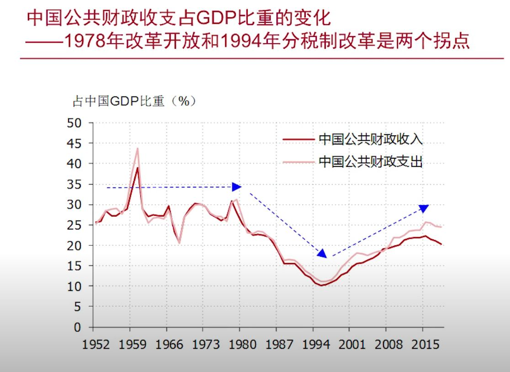
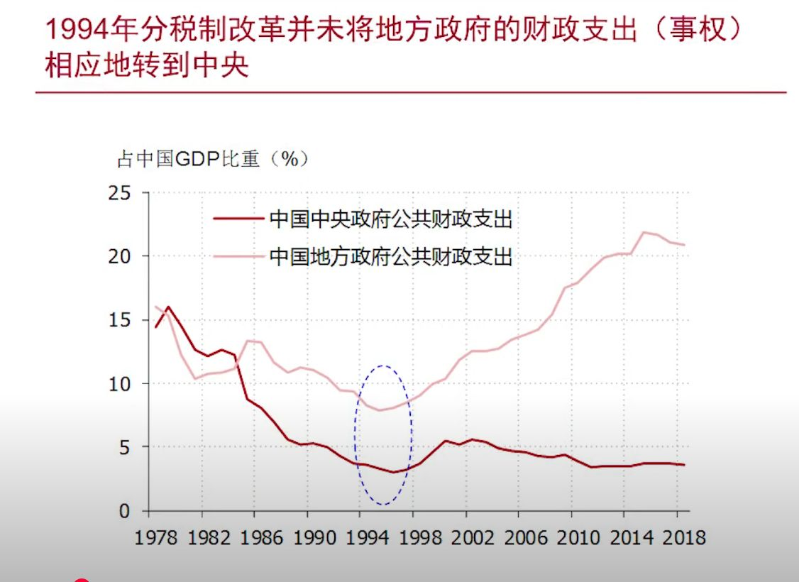
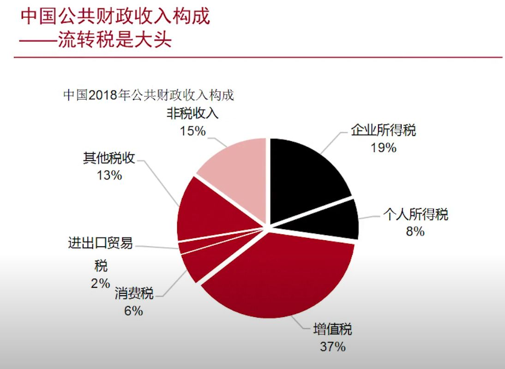
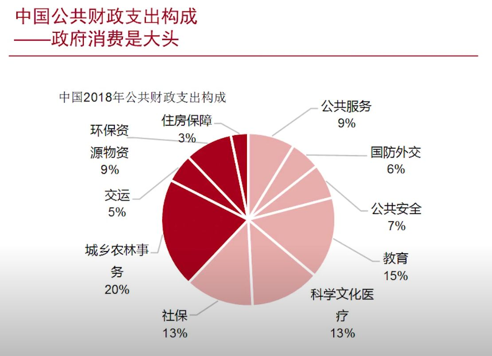
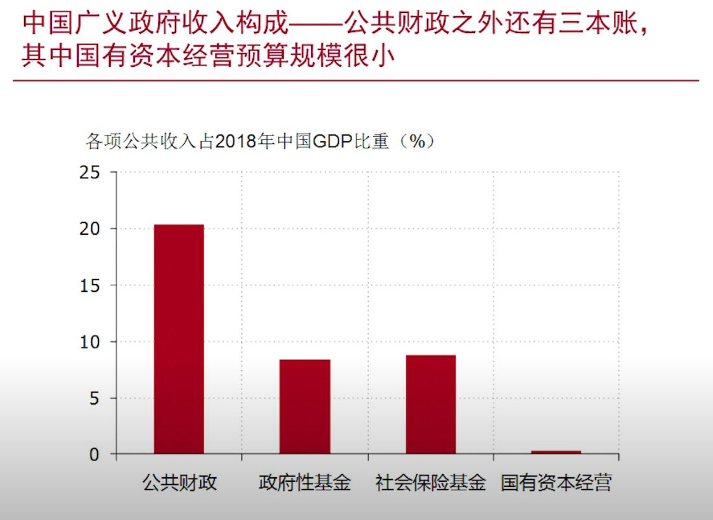
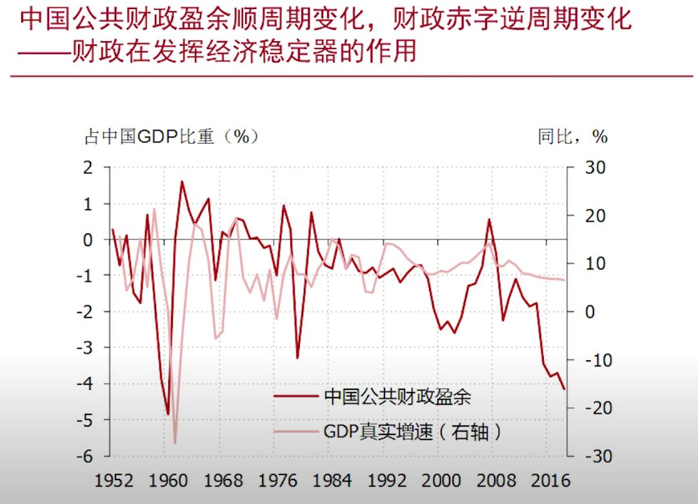
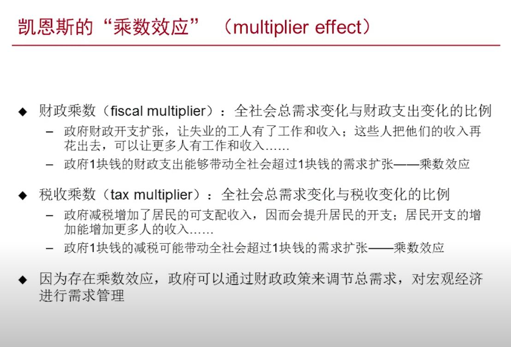
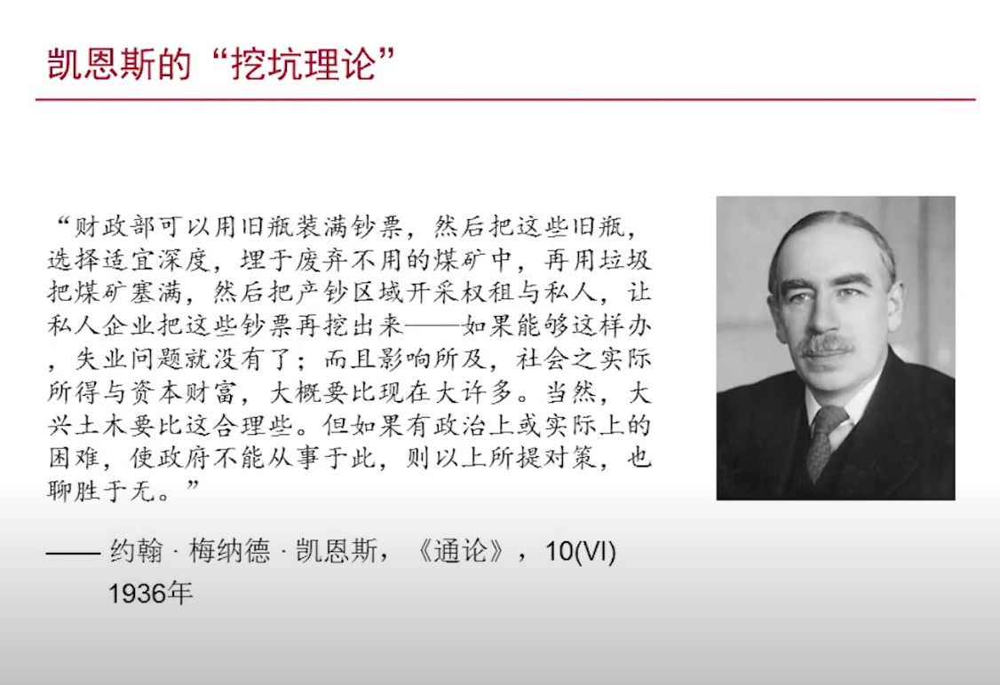
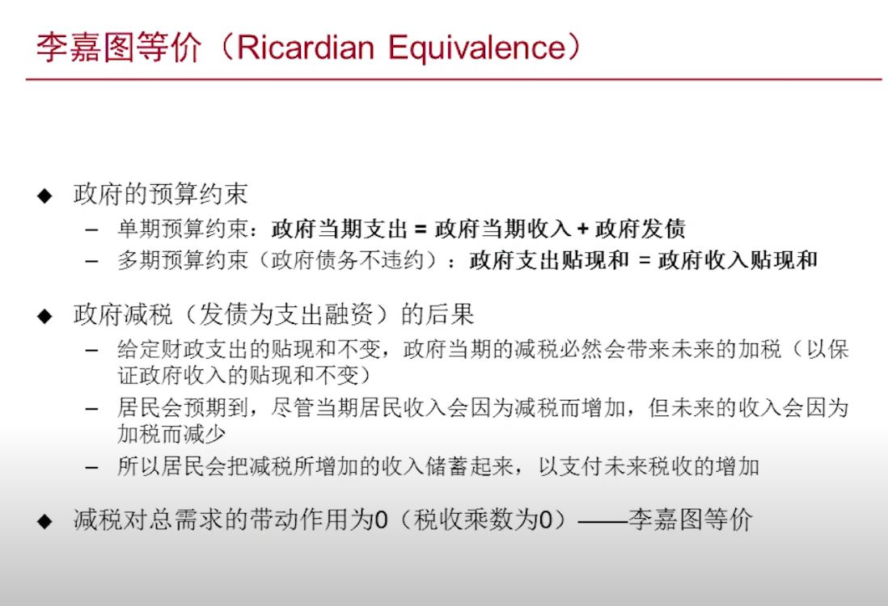

## 财政政策：凯恩斯、李嘉图

### 中国公共财政支出占 GDP 比重的变化 -- 1978 年改革开放和 1994 年分税制改革是两个拐点

### 1994年的分税制改革把相当部分的财政收入（财权）上收到了中央政府

### 1994年分税制改革并未将地方政府的财政支出（事权）相应地转到中央

### 中国公共财政收入构成 -- 流转税是大头

### 中国公共财政支出构成 -- 政府消费是大头

### 中国广义政府收入构成 -- 公共财政之外还有三本账，其中国有资本经营预算规模很小

### 中国公共财政盈余顺周期变化，财政赤字逆周期变化 -- 财政在发挥经济稳定器的作用

### 凯恩斯的“乘数效应”（multiplier effect）

### 凯恩斯的“挖坑理论”

### 李嘉图等价

## 初识货币

## 财政政策与货币政策的配合

