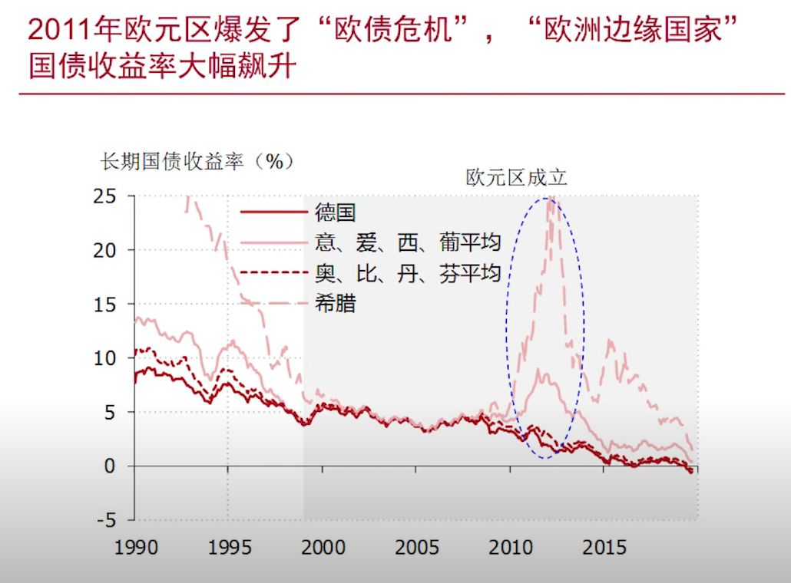
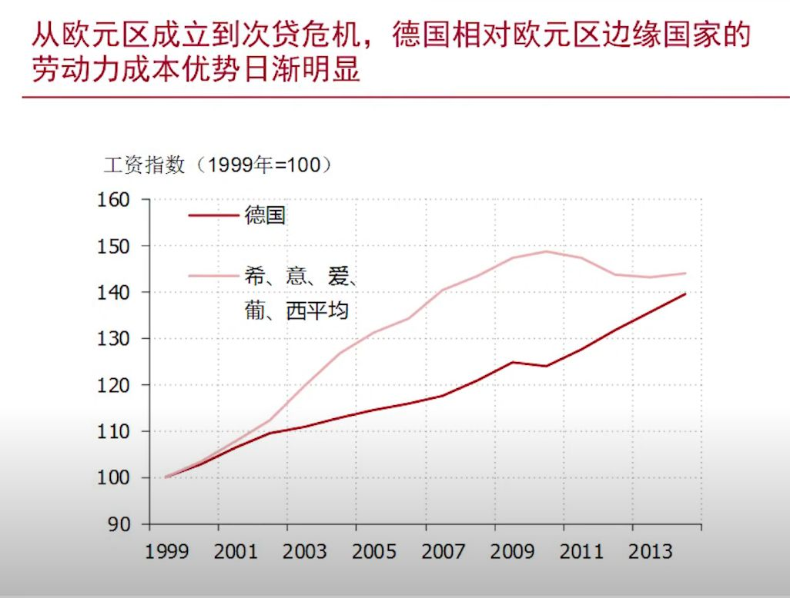
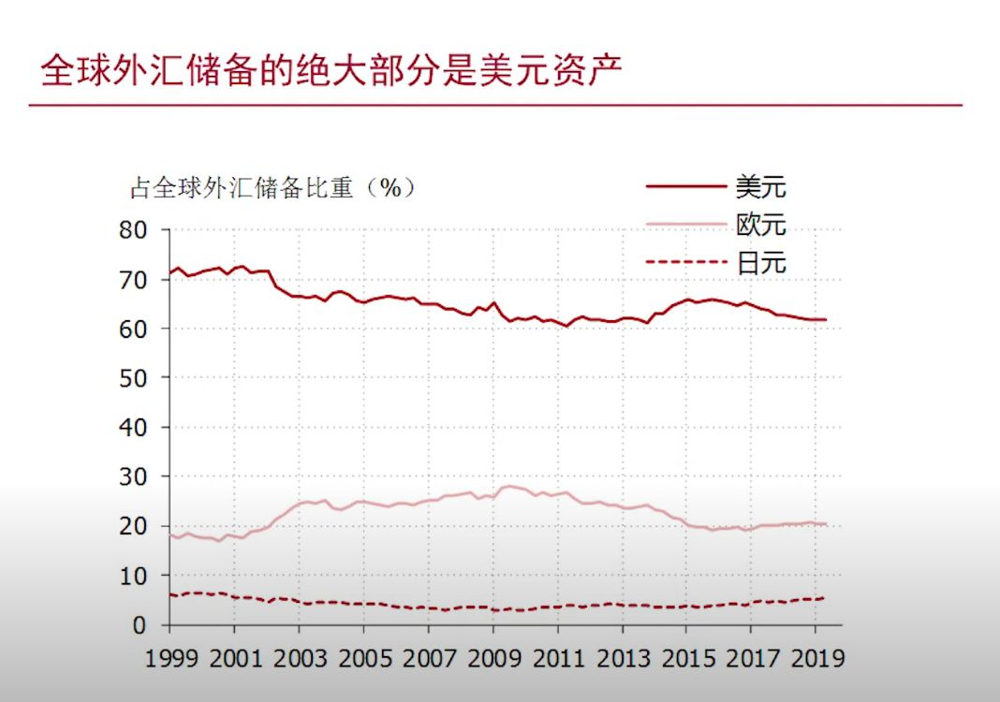
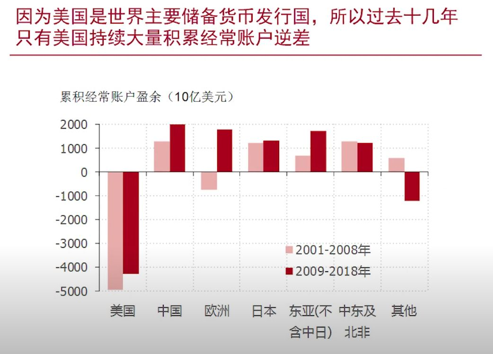
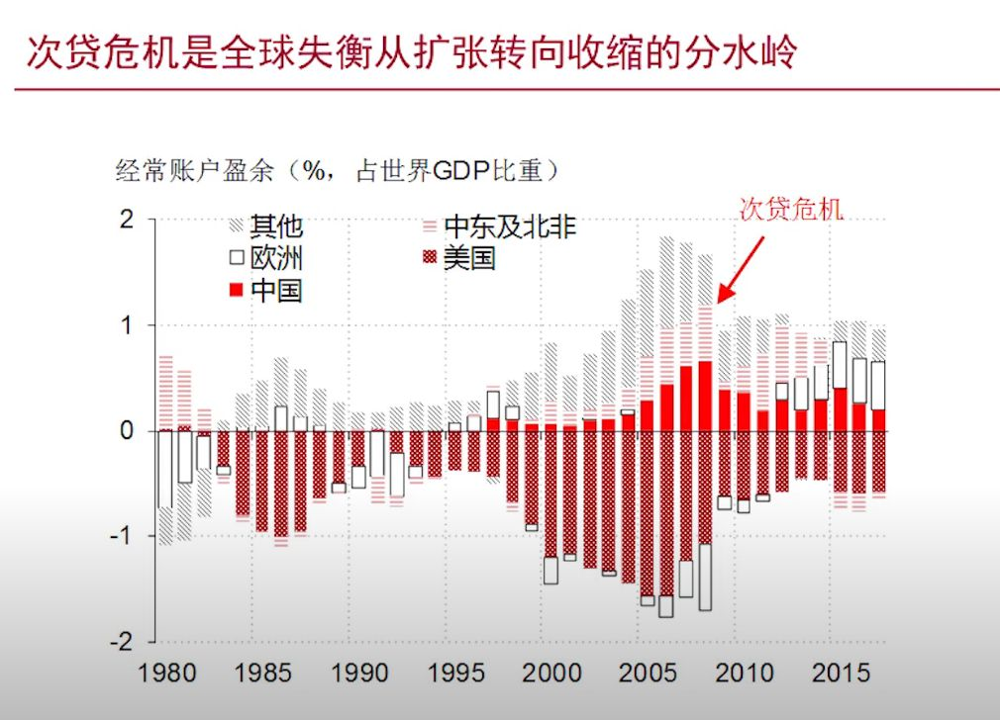
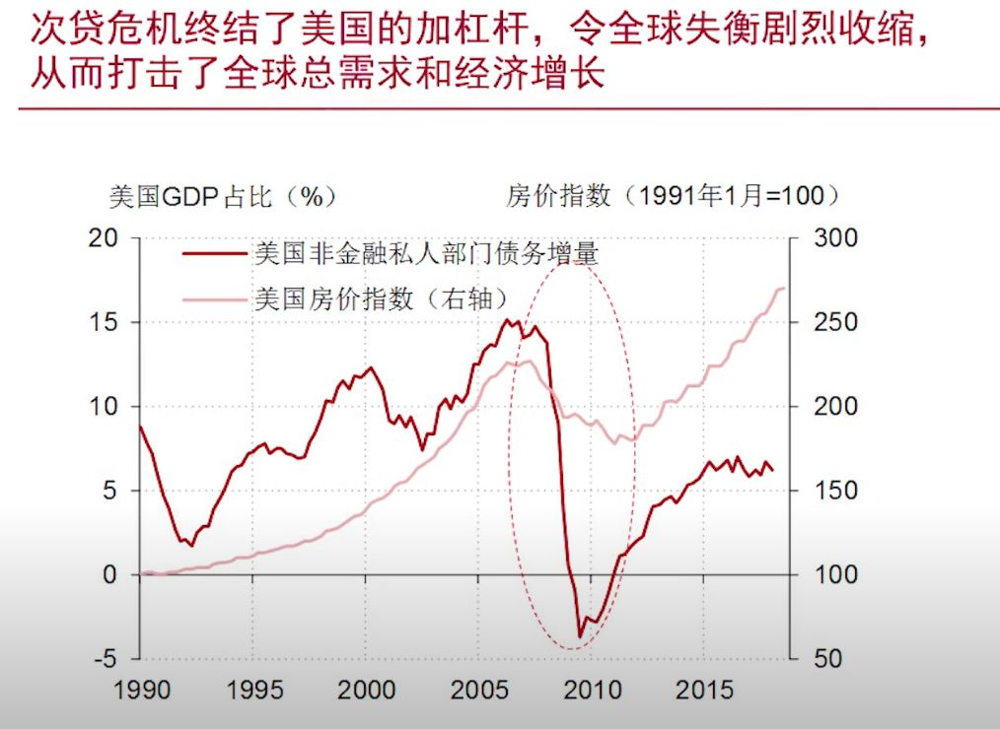
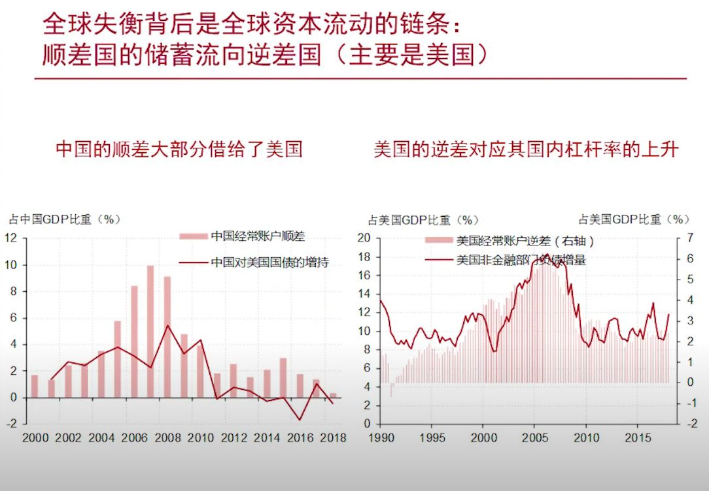

## 国际收支危机
### 2011年欧元区爆发了“欧债危机”，“欧洲边缘国家”债券收益率大幅飙升

- 阴影部分欧元区成立
### 什么让“欧洲边缘国家”如此特殊？不是国债的数量

### 经常账户的赤字才是“欧洲边缘国家”的共性

### 从欧元区成立到次贷危机，德国相对欧元区边缘国家的劳动力成本优势日渐明显

### 欧元区成立之后，欧元区内部呈现出了愈演愈烈的失衡格局

- ...

### 欧央行为什么这么重要？欧央行结算账户下隐藏了欧元区内部跨境转移支付

## 次贷危机

### 全球外汇储备的绝大部分是美元资产

### 因为美国是世界主要储备货币发行国，所以过去十几年只有美国持续大量积累经常账户逆差

### 次贷危机是全球失衡从扩张转向收缩的分水岭

### 次贷危机终结了美国的加杠杆，令全球失衡剧烈收缩，从而打击了全球总需求和经济增长

### 全球失衡背后是全球资本流动的链条：顺差国的储蓄流向逆差国（主要是美国）

### 全球失衡的收缩打击了我国的外需，令我国经济面临沉重下行压力

