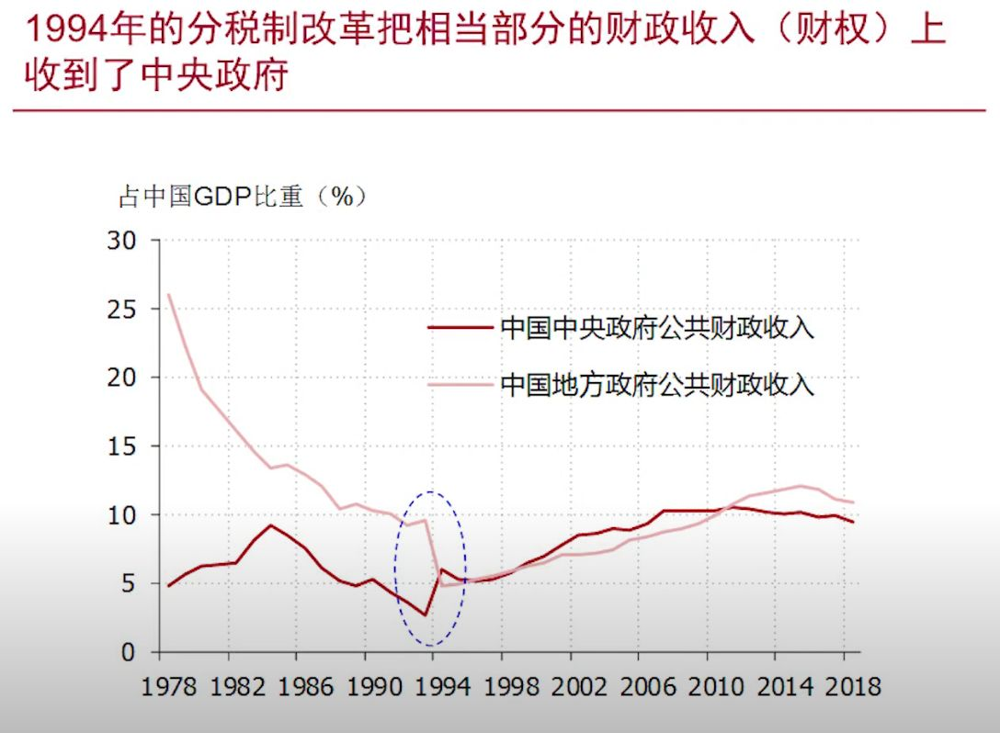
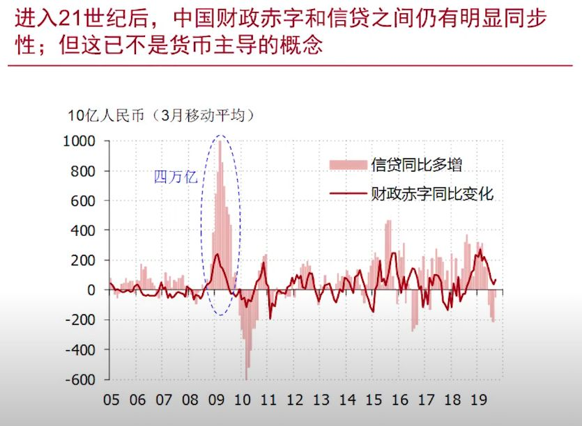

## 财政政策：凯恩斯、李嘉图

### 中国公共财政支出占 GDP 比重的变化 -- 1978 年改革开放和 1994 年分税制改革是两个拐点

### 1994年的分税制改革把相当部分的财政收入（财权）上收到了中央政府

### 1994年分税制改革并未将地方政府的财政支出（事权）相应地转到中央

### 中国公共财政收入构成 -- 流转税是大头

### 中国公共财政支出构成 -- 政府消费是大头

### 中国广义政府收入构成 -- 公共财政之外还有三本账，其中国有资本经营预算规模很小

### 中国公共财政盈余顺周期变化，财政赤字逆周期变化 -- 财政在发挥经济稳定器的作用

### 凯恩斯的“乘数效应”（multiplier effect）

### 凯恩斯的“挖坑理论”

### 李嘉图等价

## 初识货币

### M0 = 流通中现金

### M1 = M0 + 企业活期存款

### M2 = M1 + 企业定期存款 + 居民活期定期存款

###  中国货币存量变化趋势

### 中国的 M1 增速对 CPI 有明显的领先性

### 中国的 M1 增速与指数之间有极高的相关性

## 财政政策与货币政策的配合

### 中国货币运行以1995年为界划分了差异明显的两个阶段

### 财政主导 vs 货币主导

#### 财政主导     

**财政支出**贴现和 = **财政收入**贴现和 + **铸币税**贴现和

#### 货币主导

**财政支出**贴现和 = **财政收入**贴现和

### 中国 80 年代的“财政主导”

### 1988年抢购电冰箱

### 1988年生活用品抢购潮

### 1988年武汉抢购黄金首饰

### 《人民银行法》确定了货币主导的框架

### 中国人民银行资产负债表（2019年9月，单位万亿元）

### 拉弗曲线对铸币税同样适用

### 恶性通货膨胀总是来自财政的失败

 

### 恶性通货膨胀：德国魏玛共和国时期德国小孩拿纸币当玩具

### 恶性通货膨胀：1948年上海发薪日

### 恶性通话膨胀：21世纪，津巴布韦100万亿面额的纸币

### 终结恶性通货膨胀，需要先修复财政问题

- 1984年，杰夫·萨克斯（Jeff Sachs）靠提升玻利维亚的石油价格（并辅助以其他财政整固措施）结束了那里24000% 的恶性通货膨胀

### 转向货币主导后，财政赤字规模的扩张再未导致货币发行与通胀的失控

### 进入21世纪后，中国财政赤字和信贷之间仍有明显同步性；但这已不是货币主导的概念

